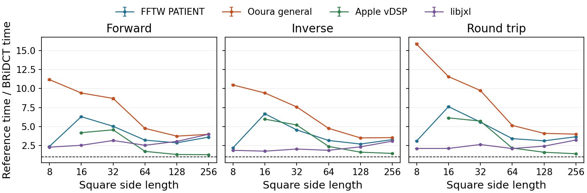
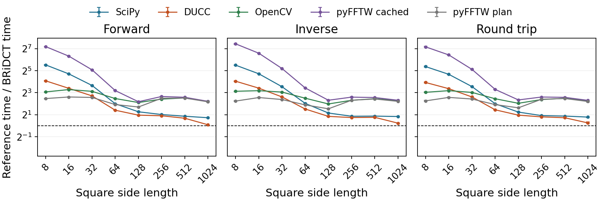
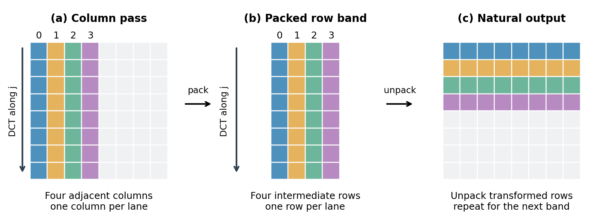

# BRiDCT

Fast two-dimensional DCTs in C11, with SIMD acceleration and an optional NumPy interface.

BRiDCT uses the Shao–Johnson factorization for every library route. It computes the orthonormal DCT-II, its inverse, and a normalized round trip on float32 arrays. Each axis can independently be 8, 16, 32, 64, 128, 256, 512 or 1024. Rectangles are supported; other lengths are rejected rather than silently padded.

**Paper:** Antoine Moevus and Max Mignotte, [BRiDCT: Fast Two-Dimensional DCTs Using SIMD](https://arxiv.org/abs/2609.28519), 2026.

## Performance at a glance

**Apple M3 Max · BRiDCT dev.7 · native calls · 8×8–256×256.**



Above the dashed **1×** line, BRiDCT is faster: **reference time / BRiDCT time**. These are the paper's session-2 ratios of median times, with descriptive paired-bootstrap 95% intervals over 21 blocks. Natural array layout and adapter copies are included; vDSP has no 8×8 measurement. Results apply to the measured Mac and interfaces.

## Download and run

Get a source package from [Releases](https://github.com/antmoev/bridct/releases). Extract the entire ZIP, open its `bridct` folder, and follow `START_HERE.md`.

| Platform | Package | First command |
|---|---|---|
| Apple Silicon macOS | `bridct-0.2.0-dev.7-r1-macos.zip` | `bash distribution/run_macos.sh --verify --python python3` |
| Ubuntu 22.04/24.04 x86-64 | `bridct-0.2.0-dev.7-r1-ubuntu.zip` | `bash distribution/run_ubuntu.sh --quick` |
| Windows x86-64 | `bridct-0.2.0-dev.7-r1-windows.zip` | Double-click `run_windows.cmd` |

These are source packages with build/test launchers, not precompiled installers. All three contain the same kernels and verification data. Initial dependency installation needs Internet. The launchers record failures and machine/software information locally; they never upload results. Mac users need native Python and Apple Command Line Tools. Ubuntu asks before installing missing system packages. Windows prepares private Python/MSYS2 tools. [Platform scope](docs/PLATFORMS.md) lists validation limits.

For benchmarks after the Mac verification, use `--quick` instead of `--verify`. Ubuntu and Windows default to verification followed by comparisons. See the [Mac](distribution/README.macos.md), [Ubuntu](distribution/README.ubuntu.md) and [Windows](distribution/README.windows.md) instructions for options and result locations.

## Build only the C library

With a C11 compiler and Make:

```sh
make -j2
make check
./build/roundtrip 16 32
```

On Windows, build within MSYS2 CLANG64 as described in the platform instructions. No Python, FFTW or image-codec runtime is required by the C library. See the [C API](docs/API.md) and [complete example](examples/roundtrip.c).

For Python/NumPy, first install NumPy and SciPy into your chosen Python environment, then:

```sh
make -C python PYTHON=python3
make -C python check-full PYTHON=python3
```

See the [NumPy API](python/README.md) for array layout, reusable outputs and plan ownership.

## Accuracy and performance

“Exact DCT” means the mathematical transform is preserved, without an approximate transform matrix. Floating-point rounding, overflow and weak-component limitations still apply. The [verification dataset](dataset/README.md) contains 474 synthetic arrays, with 420 core inputs and 54 separately reported boundary inputs. Independent tests also cover all 64 supported shapes.

The paper measures dev.7 on an Apple M3 Max. Its results do not establish superiority on every processor. Native and Python comparisons use different call boundaries and are reported separately; no estimated Python overhead is subtracted. [Measurement correspondence](docs/RESULTS_MAP.md) explains how to access the recorded data and run new comparisons.

### From Python

**Apple M3 Max · compiled NumPy interface · one image per call · 8×8–1024×1024.**



The vertical axis is logarithmic; above **1×** favors BRiDCT. Session-2 measurements include calls, allocations, copies and normalization. Round trips use separate forward and inverse calls for both methods. Each curve uses its own paired comparison; absolute times from different campaigns are not pooled. These are complete interface comparisons, not rankings of pure C kernels. Error bars are descriptive paired-bootstrap 95% intervals.

### How the SIMD organization works



A conceptual 8×8 example of the banded route: four adjacent columns share a vector, then four intermediate rows are packed, transformed and unpacked. The band uses scratch memory; small kernels can use different organizations. BRiDCT preserves the Shao–Johnson factorization while adapting data movement and SIMD execution.

Figures are reproduced unchanged from the [paper](https://arxiv.org/abs/2609.28519v1), by Antoine Moevus and Max Mignotte. The [recorded measurements](https://github.com/antmoev/bridct/releases/tag/v0.2.0-dev.7-r1) and [measurement correspondence](docs/RESULTS_MAP.md) provide the supporting data and protocols.

## Repository contents

| Directory | Purpose |
|---|---|
| `include/`, `src/`, `examples/` | C library, headers and a runnable example |
| `python/` | NumPy interface and Python benchmarks |
| `dataset/` | Verification arrays, metadata and independent checks |
| `tests/` | Numerical, API and package checks |
| `bench/` | Timing tools and optional reference implementations |
| `tools/` | SIMD kernel generators and source integrity checks |
| `distribution/` | Platform build/test launchers and source ZIP builder |
| `docs/` | API, platform instructions and illustrated results |
| `third_party/` | Required SIMD compatibility headers and their licenses |

To create your own software ZIPs, see [package instructions](docs/RELEASING.md).

## Versions, data and licenses

The numerical implementation remains **0.2.0-dev.7**. Packaging revision **0.2.0-dev.7-r1** adds this standalone repository, corrected documentation and release tools; it does not change the kernels or input arrays. [Provenance](PROVENANCE.json) records the paper snapshot and immutable source hashes.

Original code and tools use [BSD-3-Clause](LICENSE). Verification arrays and metadata use [CC BY 4.0](dataset/LICENSE). SIMDe and the optional Ooura benchmark controls retain their [attribution and permissions](NOTICE.md). Ooura is not linked into BRiDCT.

Cite the [paper](https://doi.org/10.48550/arXiv.2609.28519) and identify the software version used; [CITATION.cff](CITATION.cff) and the [dataset citation](dataset/CITATION.cff) provide metadata. See [CONTRIBUTING.md](CONTRIBUTING.md) for development.
